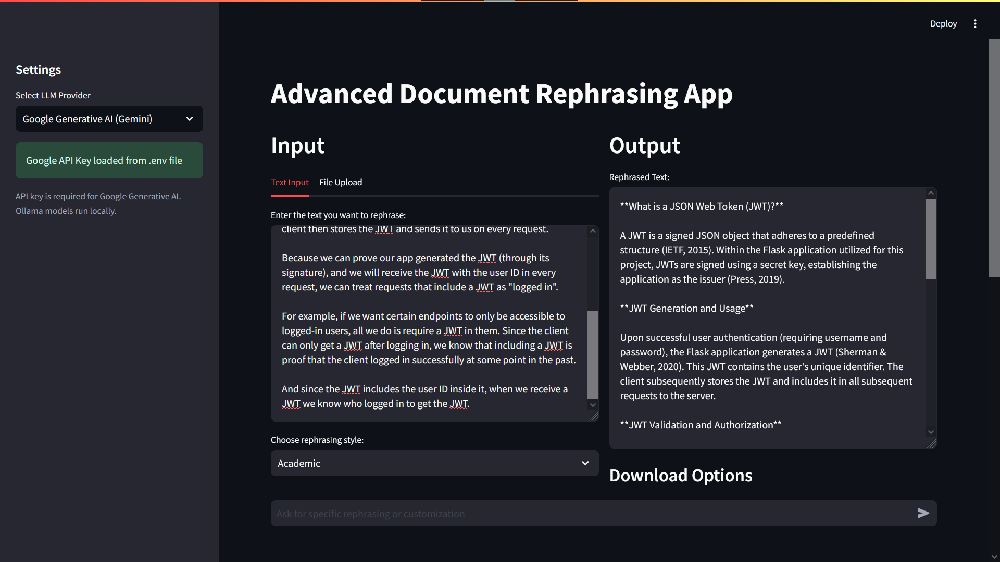

# Advanced Document Rephrasing App

## Overview

The Advanced Document Rephrasing App is a powerful tool designed to rephrase and customize text in various styles using state-of-the-art language models. This application leverages the capabilities of Google's Generative AI (Gemini) and local Ollama models to provide users with flexible and context-aware text rephrasing options.


App URL: https://yahia-advanced-document-rephrasing-app.streamlit.app/

## Features

- **Multiple Input Methods**: Accept text input directly or upload documents (TXT, PDF, MD, DOCX).
- **Various Rephrasing Styles**: Choose from Formal, Casual, Simple, Academic, Creative, and Professional styles.
- **Customization Options**: Fine-tune the output with style-specific parameters.
- **Multiple LLM Providers**: Support for Google Generative AI (Gemini) and various Ollama models.
- **Chat Interface**: Interact with the AI to further customize the rephrased text.
- **Download Options**: Save the rephrased text in TXT, MD, or DOCX formats.

## Installation

1. Clone the repository:

```bash
git clone https://github.com/yahiaAlg/advanced-document-rephrasing-app.git
cd advanced-document-rephrasing-app
```

2. Install the required dependencies:

```bash
pip install streamlit langchain langchain_google_genai langchain_community pypdf python-docx python-dotenv
```

3. Set up your environment variables:
Create a `.env` file in the project root and add your Google API key:
`GOOGLE_API_KEY=your_api_key_here`

## Usage

1. Run the Streamlit app:
`streamlit run app.py`


2. Open your web browser and navigate to the provided local URL (usually `http://localhost:8501`).

3. Select your preferred LLM provider and enter the API key if required.

4. Input your text or upload a document.

5. Choose a rephrasing style and adjust the customization options.

6. Click "Rephrase" to generate the rephrased text.

7. Use the chat interface for further customization if needed.

8. Download the final result in your preferred format.

## Use Cases

### 1. Academic Writing Enhancement

**Scenario**: A graduate student wants to improve the formal tone of their research paper introduction.

**Steps**:
1. Upload the research paper introduction (DOCX file).
2. Select "Academic" style.
3. Choose options:
- Citation Style: APA
- Technical Level: Graduate
- Discipline: Social Sciences
- Tone: Analytical, Objective
- Voice: Active
4. Click "Rephrase".
5. Use the chat to request: "Customize academic style: Incorporate more hedging language and add a clear thesis statement."

**Result**: A more polished, academic-style introduction with appropriate citations, technical language, and a clear thesis statement.

### 2. Business Proposal Simplification

**Scenario**: A manager needs to simplify a complex business proposal for a general audience.

**Steps**:
1. Paste the original proposal text.
2. Select "Simple" style.
3. Choose options:
- Reading Level: High School
- Sentence Structure: Simple, Compound
4. Click "Rephrase".
5. Use the chat to request: "Customize simple style: Include more real-world examples and explain technical terms."

**Result**: A simplified version of the proposal that maintains key information while being more accessible to a general audience.

### 3. Creative Writing Transformation

**Scenario**: An author wants to add more flair to a descriptive passage in their novel.

**Steps**:
1. Input the original descriptive text.
2. Select "Creative" style.
3. Choose options:
- Literary Devices: Metaphors, Personification
- Narrative Voice: Third-person
4. Click "Rephrase".
5. Use the chat to request: "Customize creative style: Emphasize sensory details and create a more mysterious atmosphere."

**Result**: A vivid, engaging passage with rich metaphors, personification, and sensory details that enhance the mysterious atmosphere.

### 4. Professional Email Formalization

**Scenario**: An employee needs to formalize a casual email draft for a client communication.

**Steps**:
1. Paste the casual email draft.
2. Select "Formal" style.
3. Choose options:
- Formality Level: 4
- Professionalism: Business
4. Click "Rephrase".
5. Use the chat to request: "Customize formal style: Ensure appropriate salutations and closings, and include a call to action."

**Result**: A polished, professional email with appropriate formal language, structure, and a clear call to action.

### 5. Technical Document Simplification

**Scenario**: A tech company wants to create a user-friendly version of their product documentation.

**Steps**:
1. Upload the technical documentation (PDF).
2. Select "Simple" style.
3. Choose options:
- Reading Level: Middle School
- Sentence Structure: Simple, Compound
4. Click "Rephrase".
5. Use the chat to request: "Customize simple style: Break down complex processes into step-by-step instructions and add brief explanations for technical terms."

**Result**: A more accessible version of the documentation with clear, step-by-step instructions and explanations of technical concepts.

## Contributing

Contributions to improve the Advanced Document Rephrasing App are welcome! Please feel free to submit pull requests or open issues to suggest enhancements or report bugs.

## License

This project is licensed under the MIT License - see the [LICENSE](LICENSE) file for details.